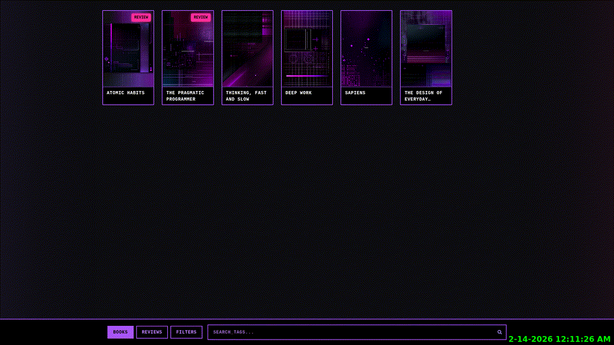

# Book Catalogue (Under Construction)

Intended to be hosted on <https://books.ashhill.dev>

  

  

## Maintenance

`public/books.json` is the source of truth for the book contents on the site.

Any new books without covers will use DALL-E to generate a new cover that goes along with the current theme. 

The current theme is decided via `coverStyle` in `public/config.json` in order to have the generated art have a bit of uniformity.

## TODO

- Change the search bar to search for title and not tags since we have a tag filter now.

- Have idea for an animation in the bg but need to figure out how to do it via AI tools.

- Fill out book contents; what is there right now are just placeholders.

- A book dislike list could be cool. could have the buttons be like '❤️ Books' and '👎 Books'. I suppose the Review display and pop open box contents would be the same. Yeah, I'm doin this.
